# Mapa de Localizaciones - D&D Copilot

## 📍 Diagrama de Navegación

```mermaid
graph TD
    VS[Village Square<br/>Plaza Central]
    
    %% Localizaciones del pueblo
    VS --> |"Go to tavern"| TD[The Rusty Dragon Tavern<br/>Taberna]
    VS --> |"Go to blacksmith"| BF[Blacksmith's Forge<br/>Fragua]
    VS --> |"Go to store"| GS[General Store<br/>Tienda]
    VS --> |"Go to town hall"| TH[Town Hall<br/>Ayuntamiento]
    
    %% Localizaciones de aventura
    VS -.-> |"Exploración"| DF[Dark Forest<br/>Bosque Oscuro]
    VS -.-> |"Exploración"| AR[Ancient Ruins<br/>Ruinas Antiguas]
    VS -.-> |"Exploración"| CC[Crystal Cavern<br/>Caverna Cristal]
    VS -.-> |"Exploración"| PS[Poison Swamp<br/>Pantano Venenoso]
    VS -.-> |"Exploración"| FM[Frozen Mountain<br/>Montaña Helada]
    VS -.-> |"Exploración"| AT[Abandoned Temple<br/>Templo Abandonado]
    VS -.-> |"Exploración"| FD[Fire Desert<br/>Desierto de Fuego]
    VS -.-> |"Exploración"| RF[Ruined Fortress<br/>Fortaleza en Ruinas]
    VS -.-> |"Exploración"| DD[Dark Dungeon<br/>Calabozo Oscuro]
    VS -.-> |"Exploración"| AIT[AI Tower<br/>Torre IA]
    
    %% Retornos
    TD --> |"back/leave"| VS
    BF --> |"back/leave"| VS
    GS --> |"back/leave"| VS
    TH --> |"back/leave"| VS
    DF --> |"escape/back"| VS
    AR --> |"escape/back"| VS
    CC --> |"escape/back"| VS
    PS --> |"escape/back"| VS
    FM --> |"escape/back"| VS
    AT --> |"escape/back"| VS
    FD --> |"escape/back"| VS
    RF --> |"escape/back"| VS
    DD --> |"escape/back"| VS
    AIT --> |"escape/back"| VS
    
    %% Estilos
    classDef pueblo fill:#9cf,stroke:#333,stroke-width:2px
    classDef aventura fill:#f9c,stroke:#333,stroke-width:2px
    classDef centro fill:#9f9,stroke:#333,stroke-width:4px
    classDef boss fill:#f66,stroke:#333,stroke-width:3px
    
    class VS centro
    class TD,BF,GS,TH pueblo
    class DF,AR,CC,PS,FM,AT,FD,RF,DD aventura
    class AIT boss
```



## 🗺️ Estructura de Navegación

### Localización Central
- **Village Square** (Plaza de la Aldea): Punto de inicio y centro del mapa. Todas las demás localizaciones retornan aquí.

### Localizaciones del Pueblo (acceso directo)
Desde Village Square puedes viajar a:
1. **The Rusty Dragon Tavern** (norte) - "Go to tavern"
2. **Blacksmith's Forge** (este) - "Go to blacksmith"
3. **General Store** (oeste) - "Go to store"
4. **Town Hall** (sur) - "Go to town hall"

### Localizaciones de Aventura (exploración)
Áreas peligrosas con enemigos:
1. **Dark Forest** - Bosque con goblins y lobos
2. **Ancient Ruins** - Ruinas con esqueletos y guardianes
3. **Crystal Cavern** - Caverna con arañas y elementales
4. **Poison Swamp** - Pantano tóxico con criaturas venenosas
5. **Frozen Mountain** - Montaña con gigantes de hielo
6. **Abandoned Temple** - Templo con no-muertos
7. **Fire Desert** - Desierto árido con bandidos
8. **Ruined Fortress** - Fortaleza con guardianes
9. **Dark Dungeon** - Calabozo laberíntico con demonios
10. **AI Tower** - Torre del jefe final (Alberto Díaz)

### Flujo de Navegación

```
Village Square
    ├─→ The Rusty Dragon Tavern ─→ back/leave ─→ Village Square
    ├─→ Blacksmith's Forge ─→ back/leave ─→ Village Square
    ├─→ General Store ─→ back/leave ─→ Village Square
    ├─→ Town Hall ─→ back/leave ─→ Village Square
    ├─→ Dark Forest ─→ escape/back ─→ Village Square
    ├─→ Ancient Ruins ─→ escape/back ─→ Village Square
    ├─→ Crystal Cavern ─→ escape/back ─→ Village Square
    ├─→ Poison Swamp ─→ escape/back ─→ Village Square
    ├─→ Frozen Mountain ─→ escape/back ─→ Village Square
    ├─→ Abandoned Temple ─→ escape/back ─→ Village Square
    ├─→ Fire Desert ─→ escape/back ─→ Village Square
    ├─→ Ruined Fortress ─→ escape/back ─→ Village Square
    ├─→ Dark Dungeon ─→ escape/back ─→ Village Square
    └─→ AI Tower ─→ escape/back ─→ Village Square
```

## 🎯 Implementación en el Código

### Mapa de Retorno (`GetMappedReturnLocation`)

El código utiliza un diccionario para mapear cada localización a su punto de retorno:

```csharp
private static string? GetMappedReturnLocation(string currentLocation)
{
    var map = new Dictionary<string, string>(StringComparer.OrdinalIgnoreCase)
    {
        ["The Rusty Dragon Tavern"] = "Village Square",
        ["Blacksmith's Forge"] = "Village Square",
        ["General Store"] = "Village Square",
        ["Town Hall"] = "Village Square",
        ["Dark Forest"] = "Village Square",
        ["Ancient Ruins"] = "Village Square",
        ["Crystal Cavern"] = "Village Square",
        ["Poison Swamp"] = "Village Square",
        ["Frozen Mountain"] = "Village Square",
        ["Abandoned Temple"] = "Village Square",
        ["Fire Desert"] = "Village Square",
        ["Ruined Fortress"] = "Village Square",
        ["Dark Dungeon"] = "Village Square",
        ["AI Tower"] = "Village Square"
    };
    return map.TryGetValue(currentLocation, out var mapped) ? mapped : null;
}
```

### Comandos de Navegación

- **Ir a una localización**: `go to <lugar>` o directamente `<lugar>`
- **Regresar**: `back`, `go back`, `return`, `leave`, `leave <lugar>`
- **Escape (desde áreas peligrosas)**: `escape`

## 📊 Características del Sistema

1. **Navegación Hub & Spoke**: Modelo estrella con Village Square como centro
2. **Sin navegación directa entre localizaciones**: No puedes ir directamente del bosque a la taberna
3. **Retorno consistente**: Todas las localizaciones retornan a Village Square
4. **Tracking de localización**: El sistema guarda CurrentLocation y PreviousLocation

## 🔮 Posibles Mejoras Futuras

### Navegación Multinivel
```
Village Square
    └─→ Dark Forest
        └─→ Deep Forest (nivel 2)
            └─→ Forest Heart (nivel 3)
```

### Conexiones Directas
```
Dark Forest ←→ Ancient Ruins
Crystal Cavern ←→ Frozen Mountain
```

### Portales o Viaje Rápido
```
Village Square ←→ AI Tower (portal mágico)
Abandoned Temple ←→ Dark Dungeon (paso secreto)
```

---

**Última actualización**: 26 de febrero de 2026  
**Versión**: 1.0
